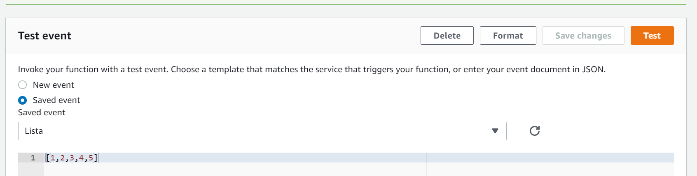
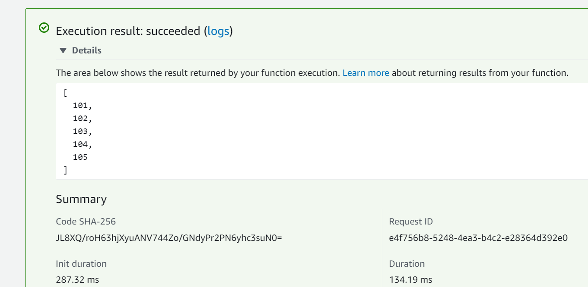
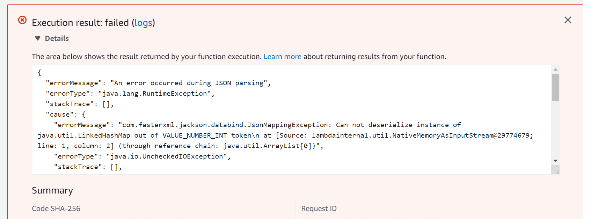
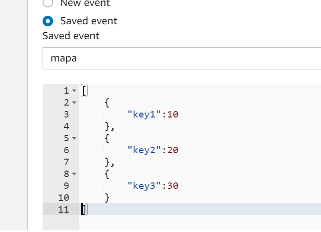
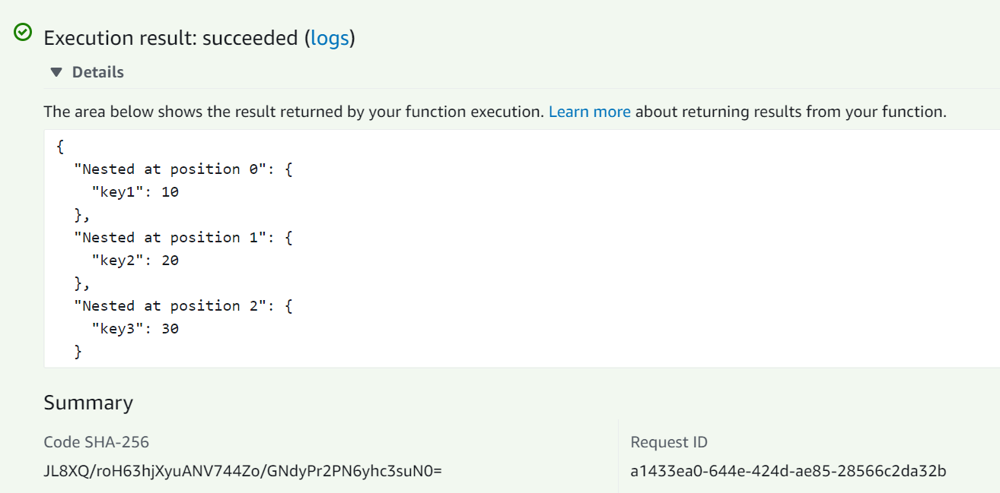
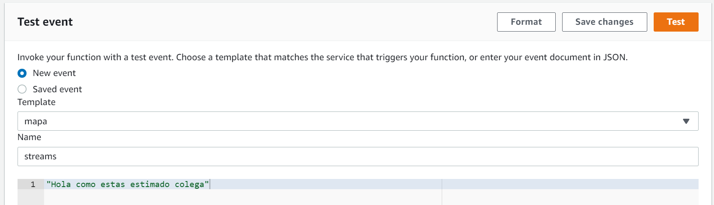
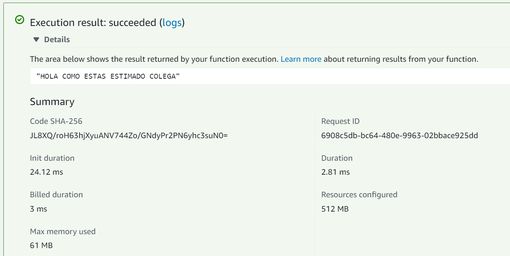
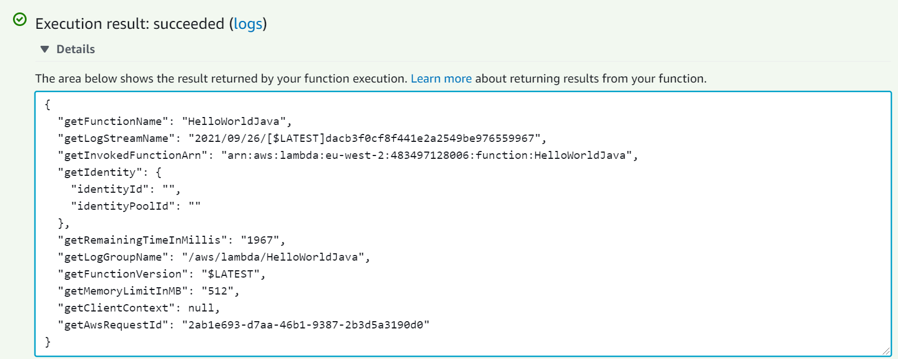

Necesitamos usar dos CLI, la CLI de AWS y la de SAM

Vamos a crear la Lambda en Java, asi que necesitaremos un jdk de Java y maven.

```ps

java -version

java version "17" 2021-09-14 LTS
Java(TM) SE Runtime Environment (build 17+35-LTS-2724)
Java HotSpot(TM) 64-Bit Server VM (build 17+35-LTS-2724, mixed mode, sharing)
```

```ps
mvn -v

Apache Maven 3.8.2 (ea98e05a04480131370aa0c110b8c54cf726c06f)
Maven home: C:\Sofware\apache-maven-3.8.2
Java version: 17, vendor: Oracle Corporation, runtime: C:\Program Files\Java\jdk-17
Default locale: en_US, platform encoding: Cp1252
OS name: "windows 10", version: "10.0", arch: "amd64", family: "windows"
```

```ps
aws --version

aws-cli/2.2.41 Python/3.8.8 Windows/10 exe/AMD64 prompt/off
```

```ps
sam --version

SAM CLI, version 1.32.0
```

Configuramos AWS en la computadora usando:

```ps
aws configure
```

Creamos una plantilla de proyecto usando `sam`:

```ps
sam init --location gh:symphoniacloud/sam-init-HelloWorldLambdaJava
```

`gh:symphoniacloud/sam-init-HelloWorldLambdaJava` hace referencia a una plantilla que se usara para crear el proyecto. `gh` hace referencia a _github_. He clonado en este directorio la plantilla.

En la plantilla que se crea destacar lo siguiente:

- El proyecto java, con el handler
- El pom con la configuración maven
- el archivo de configuración que usa `SAM` para crear la infraestructura: `template.yaml`

Para crear el paquete a desplegar hacemos:

```ps
mvn package

[INFO] ------------------------------------------------------------------------
[INFO] BUILD SUCCESS
[INFO] ------------------------------------------------------------------------
[INFO] Total time:  3.663 s
[INFO] Finished at: 2021-09-26T11:32:58+02:00
[INFO] ------------------------------------------------------------------------
```

Para hacer el despligue necesitaremos un bucket de s3. Creamos uno que se llama `egsmartin`. Para hacer el despliegue con SAM:

```ps
$Env:CF_BUCKET="egsmartin"

sam deploy --s3-bucket $Env:CF_BUCKET --stack-name HelloWorldLambdaJava --capabilities CAPABILITY_IAM
```

Crea todos los recursos definidos en _template.yaml_. Podemos ver el stack que se ha creado en cloudformation:

```ps
aws cloudformation delete-stack --stack-name HelloWorldLambdaJava
```

Podemos llamar de forma sincrona a la lambda:

```ps
aws lambda invoke --invocation-type RequestResponse --function-name HelloWorldLambdaJava-HelloWorldLambda-juIBr5YCm06W --cli-binary-format raw-in-base64-out --payload '{\"name\":\"Eugenio\"}' outputfile.txt
```

O llamarla de forma asincrona, indicando que el tipo de invocación es `Event`:

```ps
aws lambda invoke --invocation-type Event --function-name HelloWorldLambdaJava-HelloWorldLambda-juIBr5YCm06W --cli-binary-format raw-in-base64-out --payload '{\"name\":\"Eugenio\"}' outputfile.txt
```

# Recursos

Podemos modificar el _template.yaml_ para personalizar las propiedades del la lambda:

```yaml
AWSTemplateFormatVersion: 2010-09-09
Transform: AWS::Serverless-2016-10-31
Description: HelloWorldLambdaJava

Resources:

  HelloWorldLambda:
    Type: AWS::Serverless::Function
    Properties:
      FunctionName: HelloWorldJava
      Timeout: 2
      Runtime: java8
      MemorySize: 512
      Handler: book.EnvVarLambda::handler
      CodeUri: target/lambda.jar
      Environment:
        Variables:
          DATABASE_URL: my-database-url
```

- El nombre de la lambda
- El timeout - por defecto, sino se especifica nada son tres segundo
- Runtime, tamaño de la memoria
- El metodo que implementa el handler. Se `indica el paquete.clase.metodo`
- Lugar donde encontrar el jar. Cuando hagamos `sam deploy` este será el artefacto que se despliegue
- Variables de entorno

# Serialización/Deserialización

El handler puede tener una de estas firmas:

- output-type handler-name(input-type input)
- output-type handler-name(input-type input, Context context)
- void handler-name(InputStream is, OutputStream os)
- void handler-name(InputStream is, OutputStream os, Context context)

## Tipos básicos

El runtime deserializa la entrada que le _llega_ antes de pasarla al handler, y la respuesta del handler es serializada tambien por el runtime.


Con un handler como este, el runtime deserializaría la entrada en un _string_, y la respuesta tambien en un _string_:

```java
    public String handler(String s) {
        return "Hello, " + s;
    }
```

Sin embargo en este caso la serialización sería a un _boolean_ o a un _int_ respectivamente:

```java
    public boolean handlerBoolean(boolean input) {
        return !input;
    }

    public boolean handlerInt(int input) {
        return input > 100;
    }
```

## Colecciones

Si el argumento es una colección, el runtime también hara la serialización/deserialización:

- Una Lista:

```java
    public List<Integer> handlerList(List<Integer> input) {
        List<Integer> newList = new ArrayList<>();
        input.forEach(x -> newList.add(100 + x));
        return newList;
    }
```

- Un Mapa:

```java
    public Map<String, String> handlerMap(Map<String, String> input) {
        Map<String, String> newMap = new HashMap<>();
        input.forEach((k, v) -> newMap.put("New Map -> " + k, v));
        return newMap;
    }
````

- Podemos combinarlos a voluntad:

```java
    public Map<String, Map<String, Integer>> handlerNestedCollection(List<Map<String, Integer>> input) {
        Map<String, Map<String, Integer>> newMap = new HashMap<>();
        IntStream.range(0, input.size())
                .forEach(i -> newMap.put("Nested at position " + i, input.get(i)));
        return newMap;
    }
```

Hagamos una prueba. Especifiquemos en el _template.yaml_ el handler que procesa listas:


```yaml
AWSTemplateFormatVersion: 2010-09-09
Transform: AWS::Serverless-2016-10-31
Description: HelloWorldLambdaJava

Resources:

  HelloWorldLambda:
    Type: AWS::Serverless::Function
    Properties:
      FunctionName: HelloWorldJava
      Timeout: 2
      Runtime: java8
      MemorySize: 512
      Handler: book.ListMapLambda::handlerList
      CodeUri: target/lambda.jar
      Environment:
        Variables:
          DATABASE_URL: my-database-url
```

```ps
mvn package

[INFO] ------------------------------------------------------------------------
[INFO] BUILD SUCCESS
[INFO] ------------------------------------------------------------------------
[INFO] Total time:  2.640 s
[INFO] Finished at: 2021-09-26T14:21:23+02:00
[INFO] ------------------------------------------------------------------------
```

y ahora desplegamos:

```ps
aws cloudformation delete-stack --stack-name HelloWorldLambdaJava

$Env:CF_BUCKET="egsmartin"

sam deploy --s3-bucket $Env:CF_BUCKET --stack-name HelloWorldLambdaJava --capabilities CAPABILITY_IAM
```

Si probamos con una lista:



La respuesta es:



Si probamos ahora con la otra opción:

```yaml
      Handler: book.ListMapLambda::handlerNestedCollection
```

y desplegamos de nuevo:

```ps
sam deploy --s3-bucket $Env:CF_BUCKET --stack-name HelloWorldLambdaJava --capabilities CAPABILITY_IAM
```

Si volvemos a llamar obtendremos un error de serialización:



Si ahora enviamos una lista con mapas:



La respuesta sería:




## Pojos

Podemos emplear _pojos_ como argumentos:

```java
public class PojoLambda {
    public PojoResponse handlerPojo(PojoInput input) {
        return new PojoResponse("Input was " + input.getA());
    }

    public static class PojoInput {
        private String a;

        public String getA() {
            return a;
        }

        public void setA(String a) {
            this.a = a;
        }
    }

    public static class PojoResponse {
        private final String b;

        PojoResponse(String b) {
            this.b = b;
        }

        public String getB() {
            return b;
        }
    }
}
```

Notese como los campos son _private_ y se incluye un accesor que sigue la convención de nomenclatura. Sino queremos usar _setters_ y _getters_, tendremos que declarar los campos como _public_. __Importante, estas clases tienen que tener un constructor sin argumentos__.

## Streams

Cuando usamos streams, el handler tendra un stream tanto en la entrada como en la salida. La forma de procesar los datos recibidos con el stream es la que sigue:

```java
    public void handlerStream(InputStream inputStream, OutputStream outputStream)
            throws IOException {
        int letter;
        while ((letter = inputStream.read()) != -1) {
            outputStream.write(Character.toUpperCase(letter));
        }
    }
```

Recibimos desde el stream hasta que el stream se cierre. Escribimos por el stream, hasta que lo cerremos. Probemos este handler:


```ps
sam deploy --s3-bucket $Env:CF_BUCKET --stack-name HelloWorldLambdaJava --capabilities CAPABILITY_IAM
```

Supongamos que enviamos un texto al stream:



y podemos ver la respuesta:




## Contexto

Podemos usar en nuestros handlers el contexto. El contexto nos permite acceder a varias propiedades del run time. En este ejemplo incluimos las propiedades más significativas a las que tenemos acceso:

```java
    public Map<String, Object> handler(Object input, Context context) {
        Map<String, Object> toReturn = new HashMap<>();
        toReturn.put("getMemoryLimitInMB", context.getMemoryLimitInMB() + "");
        toReturn.put("getFunctionName", context.getFunctionName());
        toReturn.put("getFunctionVersion", context.getFunctionVersion());
        toReturn.put("getInvokedFunctionArn", context.getInvokedFunctionArn());
        toReturn.put("getAwsRequestId", context.getAwsRequestId());
        toReturn.put("getLogStreamName", context.getLogStreamName());
        toReturn.put("getLogGroupName", context.getLogGroupName());
        toReturn.put("getClientContext", context.getClientContext());
        toReturn.put("getIdentity", context.getIdentity());
        toReturn.put("getRemainingTimeInMillis", context.getRemainingTimeInMillis() + "");
        return toReturn;
    }
```




## Variables de Entorno

Podemos acceder a las variables de entorno de forma _normal_:


```java
    public void handler(Object event) {
        String databaseUrl = System.getenv("DATABASE_URL");
        if (databaseUrl == null || databaseUrl.isEmpty())
            System.out.println("DATABASE_URL is not set");
        else
            System.out.println("DATABASE_URL is set to: " + databaseUrl);
    }
```

